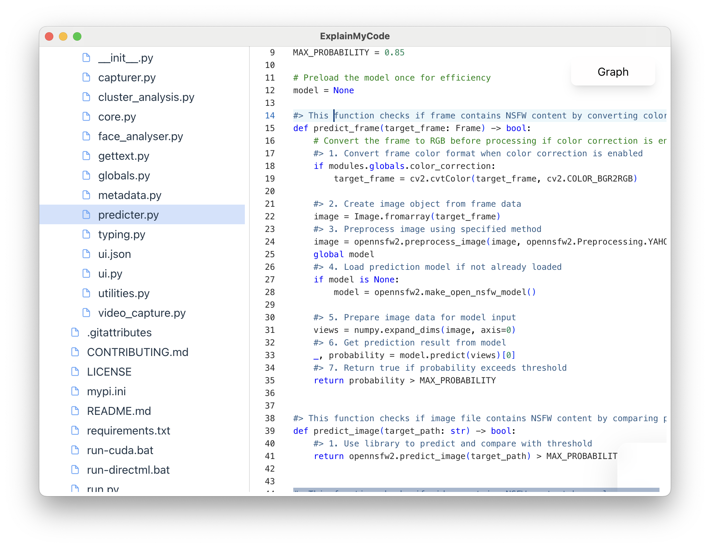
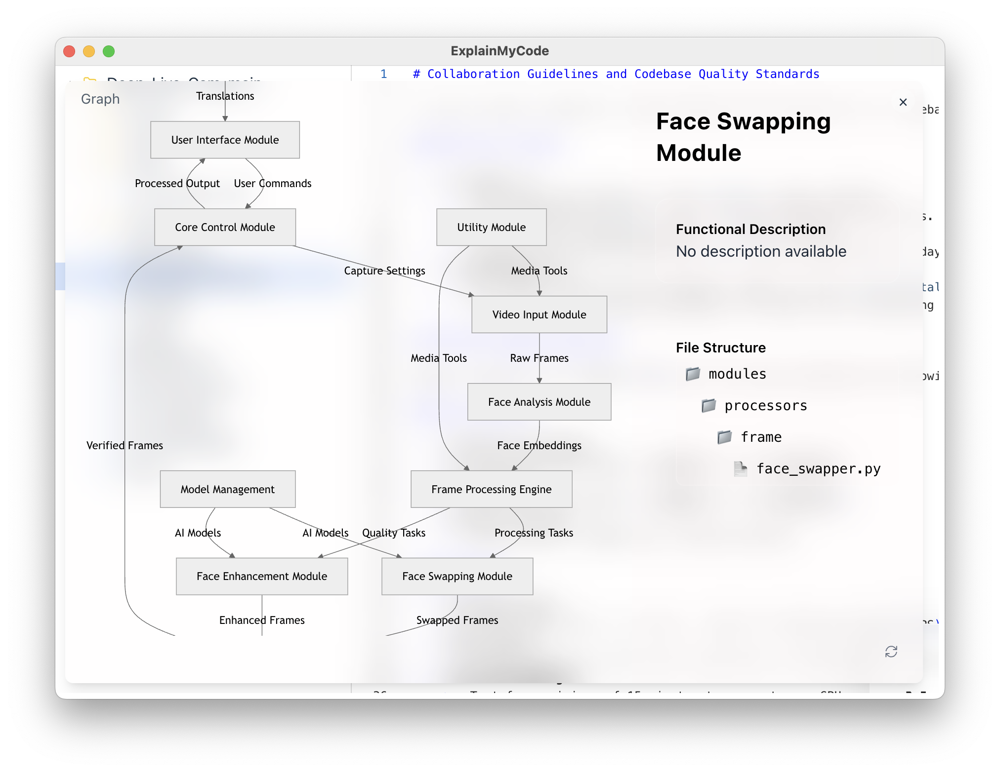
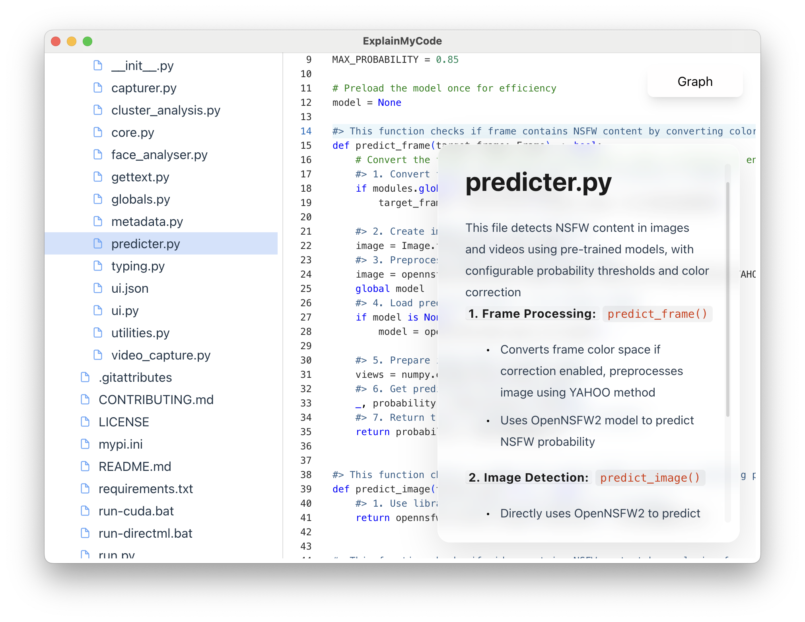

# ExplainMyCode


An AI code reader.

## Overview

`ExplainMyCode` is a desktop application designed to help developers understand and navigate codebases efficiently. By dragging a project folder into the app, it leverages AI to:
1. Generate readable explanations as comments within the code (display-only, no source code pollution).
2. Produce detailed documentation for individual files.
3. Create architecture diagrams for a quick overview of the project structure.

Currently, it supports **Python projects** and integrates with **DeepSeek** and **ChatGPT APIs** for AI analysis. The app is built with performance in mind, using Vite for fast builds, Monaco Editor for code display, and TipTap for rich text editing.

---

## Features

- **AI-Powered Code Explanations**: Automatically generates human-readable comments for your code.
- **Detailed Documentation**: Creates comprehensive breakdowns for each file in your project.
- **Architecture Visualization**: Produces diagrams to help you grasp the project structure at a glance.
- **Non-Invasive**: All explanations and comments are display-only and do not modify your source code.
- **Customizable**: Supports configuration for language, AI model, and API key.
- **Cross-Platform**: Available on Windows, macOS, and Linux via Electron.

---

## Screenshots





---

## Getting Started

### Prerequisites

- [Node.js](https://nodejs.org/) (v16 or higher recommended)
- [Yarn](https://yarnpkg.com/) package manager
- An API key from either [DeepSeek](https://deepseek.com) or [OpenAI](https://openai.com) for AI analysis

### Installation

```bash
# Clone the repository
$ git clone https://github.com/your-username/ExplainMyCode.git

# Navigate to the project directory
$ cd ExplainMyCode

# Install dependencies
$ yarn
```

### Development

Run the app locally for development:

```bash
$ yarn dev
```

### Build

Build the app for your platform:

```bash
# For Windows
$ yarn build:win

# For macOS
$ yarn build:mac

# For Linux
$ yarn build:linux
```

---

## Usage
1. **Drag and Drop**:
  - Drag and drop a Python project folder into the app’s drop zone.

2. **Wait**:
  - Wait for the initial loading to complete.

3. **Explore**:
  - Press `Ctrl + Shift + S` to trigger AI analysis.

---

## Supported APIs

- **DeepSeek**: Recommended due to cost efficiency (e.g., ~$0.06 to analyze a small project).
- **ChatGPT**: Supported but may consume more tokens for large projects.

*Note*: Token usage depends on project size. DeepSeek is more economical for analyzing all code files.

---

## Recommended IDE Setup

- [VSCode](https://code.visualstudio.com/)
- [ESLint](https://marketplace.visualstudio.com/items?itemName=dbaeumer.vscode-eslint) for linting
- [Prettier](https://marketplace.visualstudio.com/items?itemName=esbenp.prettier-vscode) for code formatting

---

## Project Structure

```
├── src
│   ├── main        # Electron main process (AI logic, file handling)
│   ├── preload     # Preload scripts for secure IPC
│   ├── renderer    # React frontend (UI components, Monaco Editor, TipTap)
│   └── types       # TypeScript type definitions
├── resources       # Static assets (icons)
└── build           # Build configurations and icons
```

---

## Contributing

Contributions are welcome! Please follow these steps:

1. Fork the repository.
2. Create a feature branch (`git checkout -b feature/your-feature`).
3. Commit your changes (`git commit -m "Add your feature"`).
4. Push to the branch (`git push origin feature/your-feature`).
5. Open a pull request.

---

## License

This project is licensed under the terms of the [MIT License](LICENSE.txt).

---

## Acknowledgments

- Built with [Electron](https://www.electronjs.org/), [React](https://reactjs.org/), [Vite](https://vitejs.dev/), [Monaco Editor](https://microsoft.github.io/monaco-editor/), and [TipTap](https://tiptap.dev/), etc.
